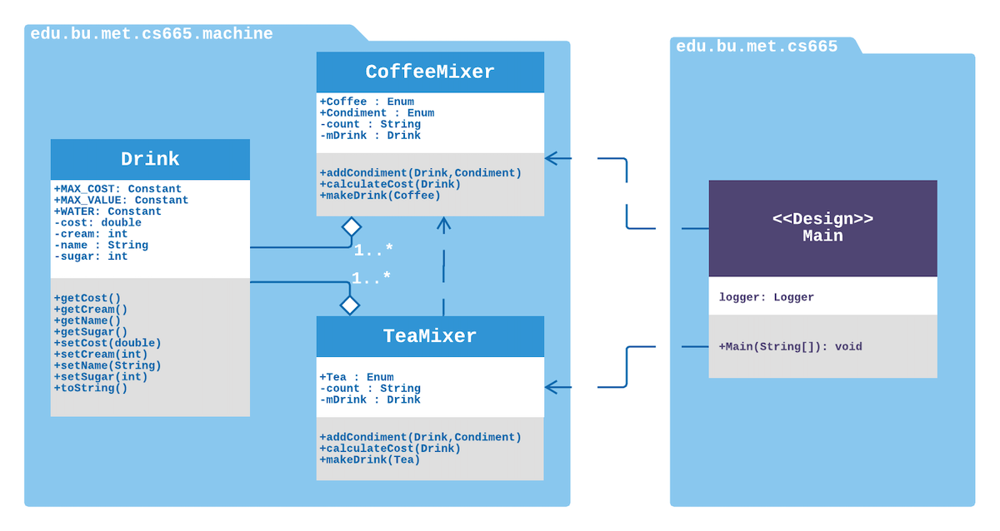

# Implementation Description

The Coffee Maker Program primarily implements robustness, flexibility and re-usability design principles.

Robustness is implemented with the program's ability to control specified integer, string and double inputs (data) types while enforcing limits with MAX and MIN values and Cost. The application also gracefully handles erroneous inputs by preserving max values and displaying info logs.

Flexibility is also handled by the individuality of the classes allowing for easy price, cost, condiments, coffee and tea flavor modifications. Two techniques employed to enhance flexibility and avoid duplication is the use of Drink.java class as a component (composition) of the Mixer classes. Additionally the use of public static visibility modifiers for the Condiment Enum type object allows for global visibility reducing duplication project.

Re-usability is also implemented by the usage of composition type relationships within classes and dependency relationships between packages. The use of the base Drink.java class allows easy code reuse for other Mixer types. By this implementation the ultimate goal of low coupling between packages and high cohesion within each package is attained.

The program implements simplicity by the directness in the package and class design, relationships and implementation. This simplicity in implementation is also evident in the use of less lines of code to attain the desired functionality. This is further evident in the simplicity and ability to unit test each single method.


# UML Class Diagram




# Project Template

This is a Java Maven Project Template


# How to compile the project

We use Apache Maven to compile and run this project. 

Type on the command line: 

```bash
mvn clean compile
```

# How to create a binary runnable package 


```bash
mvn clean compile assembly:single
```


# How to run

```bash
mvn -q clean compile exec:java -Dexec.executable="edu.bu.met.cs665.Main" -Dlog4j.configuration="file:log4j.properties"
```

# Run all the unit test classes.


```bash
mvn clean compile test

```

# Using Findbugs 

```bash
mvn findbugs:findbugs
```


# Run Checkstyle 

CheckStyle code styling configuration files are in config/ directory. Maven checkstyle plugin is set to use google code style. 
You can change it to other styles like sun checkstyle. 

To analyze this example using CheckStyle run 

```bash
mvn checkstyle:check
```

This will generate a report in XML format

```bash
target/checkstyle-checker.xml
target/checkstyle-result.xml
```

and the following command will generate a report in HTML format that you can open it using a Web browser. 

```bash
mvn checkstyle:checkstyle
```

# Generate  coveralls:report 

```bash
mvn -DrepoToken=<YOUR-REPO-TOCKEN-ON-COVERALLS> cobertura:cobertura coveralls:report
```


